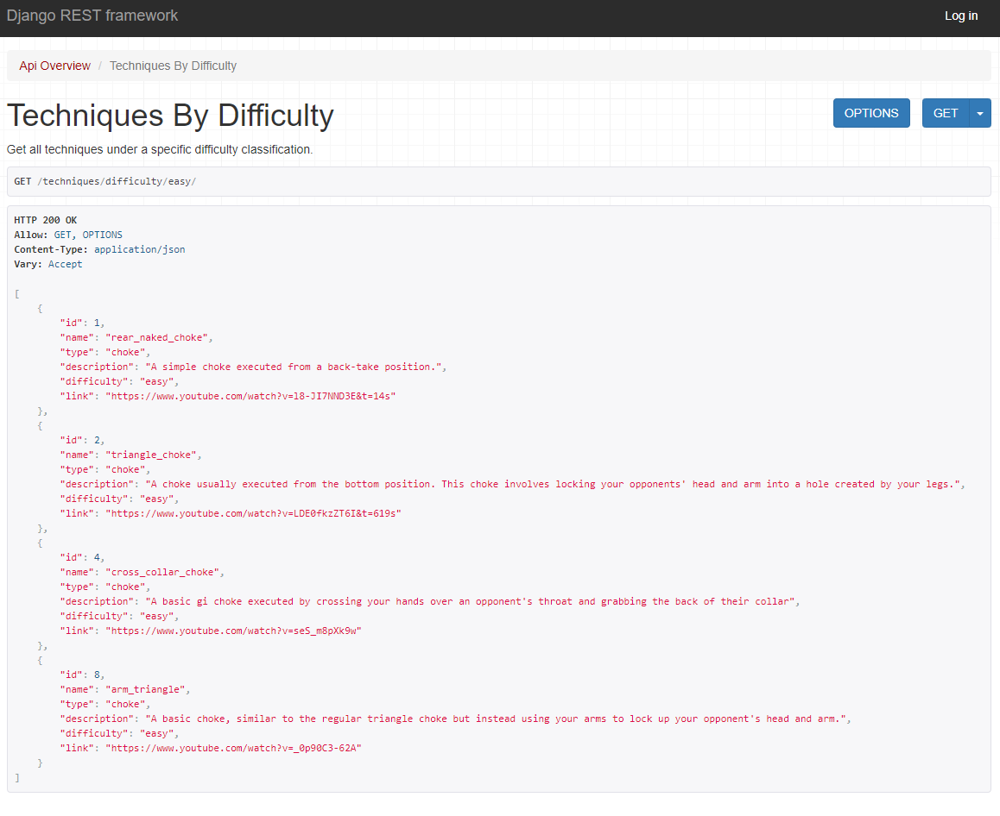

# bjjapi-djangorfw

## Overview
This REST API project is built with Python, Django, and the Django Rest Framework. The UI is the built in UI provided with the Django Rest Framework api_view decorator.
The API allows people to make GET requests that return information about different techniques found in the martial art of Brazilian Jiu Jitsu. Users with auth credentials 
are allowed to make POST and DELETE requests as well in order to add new data or modify existing data.

## Why 
Brazilian Jiu Jitsu is a martial art that I practice and really enjoy so I wanted to make a project that somehow involved it. This project idea provided a great way for me to 
include BJJ into a project while also learning important and necessary skills like creating REST API's with the Django Rest Framework.
